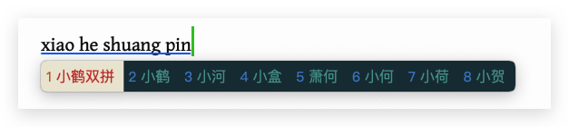

# Rime-小鹤

功能齐全，词库体验良好，长期更新修订。

 

[RIME | 中州韵输入法引擎](https://rime.im/) 是一个跨平台的输入法算法框架，这里是 Rime 的一个配置仓库。

用户需要[下载各平台对应的 Rime 发行版](https://rime.im/download/)，并将此配置应用到配置目录。
 

- 我个人使用小鹤双拼方案
- 适用于macOS版本鼠须管
- 切换中英文使用CapsLock键，禁用Shift_L

